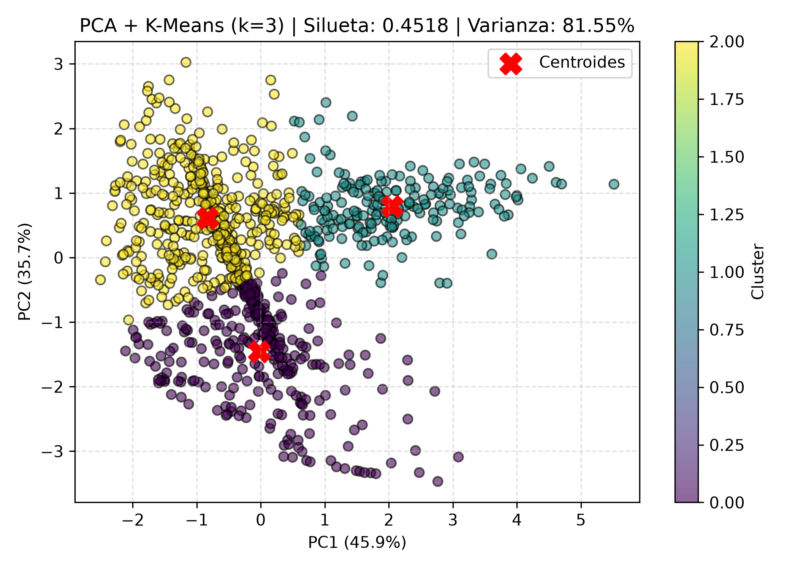

# Examen de Evaluación: Inteligencia Artificial

**Asignatura:** Inteligencia Artificial
**Estudiante:** Jhojan Abel Yana Ramos
**Dominio de Aplicación:** Telemetría de Servidores y Diagnóstico de Fallas Críticas
**Repositorio GitHub:** https://github.com/Jhojan4a/lab-evaluacion

---

## 1. Descripción y Arquitectura del Proyecto
Implementación de un pipeline modular en Python bajo la metodología Open Code que integra generación sintética de datos, preprocesamiento riguroso con prevención de fuga de información (data leakage), clasificación supervisada y agrupamiento no supervisado con proyección dimensional.

### Estructura Modular:
* **data/**: Contiene `dataset.csv` (1000 registros sintéticos, 4 variables continuas de hardware y 1 variable objetivo binaria).
* **src/**: Módulos de lógica central desacoplados:
  * `data_loader.py`: Generación controlada mediante scikit-learn y lectura persistente del dataset.
  * `preprocessing.py`: Partición Train/Test (80/20) y ajuste estricto de `StandardScaler` exclusivamente sobre datos de entrenamiento.
  * `supervised_model.py`: Ajuste, predicción y evaluación de un clasificador de Regresión Logística.
  * `unsupervised_model.py`: Reducción dimensional con PCA a 2 componentes, clustering con K-Means (k=3), Coeficiente de Silueta y visualización 2D.
* **main.py**: Orquestador principal que ejecuta el flujo analítico completo.
* **clustering_2d.png**: Gráfica 2D de dispersión de clusters y centroides en el espacio PCA.
* **.gitignore**: Exclusión de archivos compilados y entornos virtuales.
* **README.md**: Documentación técnica, reporte de métricas y cuestionario teórico.

---

## 2. Instrucciones de Ejecución
```bash
# 1. Instalar dependencias requeridas
pip install numpy pandas scikit-learn matplotlib

# 2. Ejecutar el orquestador principal
python main.py
```

---

## 3. Resultados Experimentales y Métricas

### 3.1. Salida de Terminal de la Ejecución
```text
Iniciando Pipeline de Evaluacion...
[+] Dataset generado en: data\dataset.csv
[+] Datos divididos: Train (800) - Test (200)

--- [SUPERVISADO: LOGISTIC REGRESSION] ---
Accuracy: 0.9200 (92.00%)
F1-Score: 0.9200
Matriz de Confusion:
 [[112   8]
  [  8  72]]

--- [NO SUPERVISADO: PCA + K-MEANS] ---
Varianza Acumulada 2D: 81.55%
Coeficiente de Silueta (k=3): 0.4518
[+] Grafica guardada como clustering_2d.png

[+] Fin de la ejecucion exitosa.
```

### 3.2. Visualización 2D en Espacio PCA


---

## 4. Cuestionario Teórico de Control

### 1. ¿Por qué el escalador (StandardScaler) se debe ajustar (fit) exclusivamente con el conjunto de entrenamiento y no con todo el dataset?
Para evitar la **fuga de datos (data leakage)**. Si se realiza el cálculo de la media (μ) y la desviación estándar (σ) sobre la totalidad de las 1000 instancias, la distribución del conjunto de prueba (Test) intervendría en el ajuste del modelo, otorgándole al clasificador información que no debería poseer antes de ser evaluado. El protocolo metodológico correcto exige que el escalador aprenda los parámetros únicamente con los datos de entrenamiento (`fit_transform`) y utilice esos mismos estimadores para transformar el conjunto de evaluación (`transform`), simulando fielmente el comportamiento ante nuevos datos de producción.

### 2. ¿Qué diferencia existe entre aplicar K-Means directamente sobre las 4 características versus aplicarlo sobre las 2 componentes de PCA?
Aplicar K-Means sobre las 4 dimensiones cuantitativas originales utiliza la totalidad de la información métrica sin descarte de varianza, pero puede verse afectado por variables redundantes, correlacionadas o ruido dimensional. Por el contrario, aplicar K-Means sobre las 2 componentes generadas por PCA entrena al algoritmo en un subespacio ortogonal donde los ejes están completamente descorrelacionados y ordenados por su nivel de dispersión (capturando en este caso el 81.55% de la varianza total). Esto acelera la convergencia de las distancias euclídeas de los centroides y habilita la visualización cartesiana directa en 2D, asumiendo una pérdida residual menor de información.

### 3. ¿Qué representa el Coeficiente de Silueta y cómo se interpreta un valor cercano a 1, a 0 y a -1?
El Coeficiente de Silueta es una métrica de validación interna intrínseca que evalúa cuantitativamente la calidad del agrupamiento comparando la distancia media intra-cluster (a, cohesión) frente a la distancia media al cluster vecino más cercano (b, separación):

$$s(i) = \frac{b(i) - a(i)}{\max(a(i), b(i))}$$

* **Cercano a +1:** Las instancias presentan una elevada compacidad interna en su propio cluster y un aislamiento pronunciado respecto a los clusters contiguos (partición óptima).
* **Cercano a 0:** Las observaciones están situadas en las zonas fronterizas o de solapamiento entre dos clusters.
* **Cercano a -1:** Los puntos se encuentran más próximos a las muestras de un cluster vecino que a su propio centroide, indicando una incorrecta asignación de grupo.

---

## 5. Conclusiones
* La implementación modular desacoplada en `data/` y `src/` garantiza el estándar Open Code, facilitando el mantenimiento y la ejecución reproducible a través de `main.py`.
* El clasificador de Regresión Logística alcanzó un Accuracy de 92.00% y un F1-Score ponderado de 0.9200 con bajo índice de falsas alarmas (8 falsos positivos y 8 falsos negativos).
* El modelo no supervisado sintetizó un 81.55% de la variabilidad en 2 dimensiones y delimitó satisfactoriamente 3 perfiles operativos mediante K-Means con un Coeficiente de Silueta de 0.4518.